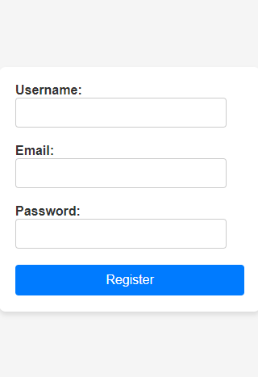

## FORM VALIDATION 
### overview  
- The form checks for credential validation, gives feedback if the user details are valid and prints error messages otherwise on form submission.  
- The form is developed using the following technologies;
    - HMTL
    - CSS
    - Javascript

### Form Usage
- Go Form-Creation-Validation repo.
- Find the code button and click on it to copy the link.
- Copy the link and use git clone [url] in your terminal to own it.
- Run the index file in the repo to view the form and interact with it.